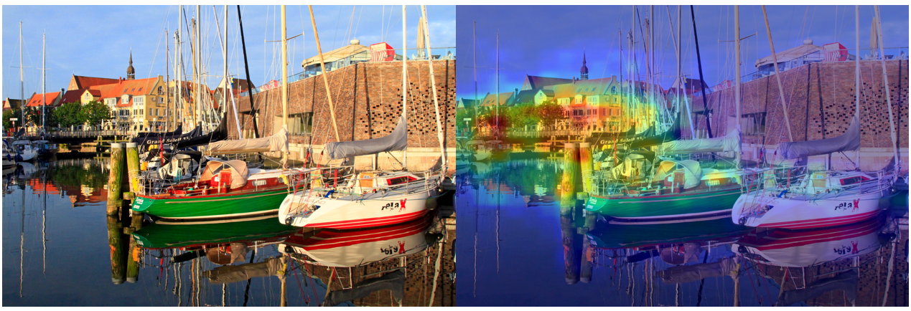
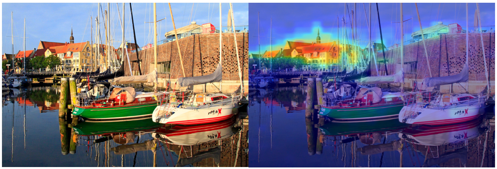
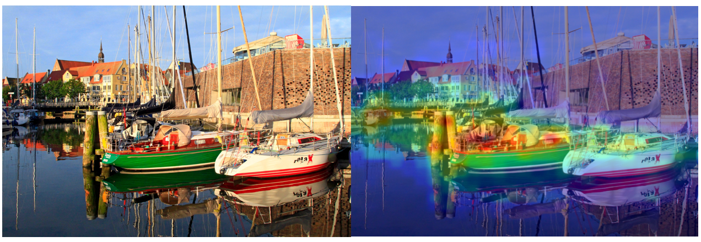

<div align="center">

# Scaling Vision Pre-Training to 4K Resolution

[](https://nvlabs.github.io/PS3/)
[](https://arxiv.org/abs/2503.19903)
[](https://huggingface.co/spaces/bfshi/VILA-HD-demo)
[](https://huggingface.co/collections/nvidia/ps3-scaling-vision-pre-training-to-4k-resolution-682d0535b61c07afd45242e9)
[](https://huggingface.co/collections/nvidia/ps3-scaling-vision-pre-training-to-4k-resolution-682d0535b61c07afd45242e9)
[](https://github.com/NVlabs/VILA/tree/main/vila_hd)

<div style="font-family: charter;">
  <a href="https://bfshi.github.io" target="_blank" style="color: #6f6f6f; text-decoration: none;">Baifeng Shi</a><sup style="font-size: 0.6em;">1,2</sup>&nbsp;&nbsp;&nbsp;
  <a href="https://sites.google.com/site/boyilics/home" target="_blank" style="color: #6f6f6f; text-decoration: none;">Boyi Li</a><sup style="font-size: 0.6em;">1,2</sup>&nbsp;&nbsp;&nbsp;
  <a href="https://han-cai.github.io/" target="_blank" style="color: #6f6f6f; text-decoration: none;">Han Cai</a><sup style="font-size: 0.6em;">2</sup>&nbsp;&nbsp;&nbsp;
  <a href="https://scholar.google.com/citations?user=OI7zFmwAAAAJ&hl=en/" target="_blank" style="color: #6f6f6f; text-decoration: none;">Yao Lu</a><sup style="font-size: 0.6em;">2</sup>&nbsp;&nbsp;&nbsp;
  <a href="https://sifeiliu.net/" target="_blank" style="color: #6f6f6f; text-decoration: none;">Sifei Liu</a><sup style="font-size: 0.6em;">2</sup>&nbsp;&nbsp;&nbsp;
  <a href="https://research.nvidia.com/person/marco-pavone" target="blank" style="color: #6f6f6f; text-decoration: none;">Marco Pavone</a><sup style="font-size: 0.6em;">2</sup>
  <br>
  <a href="https://jankautz.com/" target="_blank" style="color: #6f6f6f; text-decoration: none;">Jan Kautz</a><sup style="font-size: 0.6em;">2</sup>&nbsp;&nbsp;&nbsp;
  <a href="https://hanlab.mit.edu/songhan/" target="_blank" style="color: #6f6f6f; text-decoration: none;">Song Han</a><sup style="font-size: 0.6em;">2</sup>&nbsp;&nbsp;&nbsp;
  <a href="https://people.eecs.berkeley.edu/~trevor/" target="_blank" style="color: #6f6f6f; text-decoration: none;">Trevor Darrell</a><sup style="font-size: 0.6em;">1</sup>&nbsp;&nbsp;&nbsp;
  <a href="https://www.pmolchanov.com/" target="_blank" style="color: #6f6f6f; text-decoration: none;">Pavlo Molchanov</a><sup style="font-size: 0.6em;">2</sup>&nbsp;&nbsp;&nbsp;
  <a href="https://hongxu-yin.github.io/" target="_blank" style="color: #6f6f6f; text-decoration: none;">Hongxu Yin</a><sup style="font-size: 0.6em;">2</sup>
  <br>
  </a><sup style="font-size: 0.6em;">1</sup> UC Berkeley&nbsp;&nbsp;&nbsp;
  </a><sup style="font-size: 0.6em;">2</sup> NVIDIA&nbsp;&nbsp;&nbsp;
</div>

</div>

<hr style="border: 2px solid gray;"></hr>

## Latest Updates
- [2025.6.4] Models & code of PS3 and VILA-HD are released! We released two PS3 models (`PS3-1.5K-SigLIP` and `PS3-4K-SigLIP`) and two VILA-HD models (`VILA-HD-1.5K-8B-SigLIP` and `VILA-HD-4K-8B-SigLIP`), and the corresponding training/inference code are also released.
- [2025.4.22] Demo of VILA-HD is released! Welcome to give it a try. We are actively improving the model so any feedback is welcome!
- [2025.4.4] Selected as conference highlight at CVPR 2025. See you in Nashville!
- [2025.3.24] Initial paper release. Code and weights of PS3 and VILA-HD will be released very soon!


<hr style="border: 2px solid gray;"></hr>


## Pre-Trained Models

### PS3 models

| Vision Model    | Max Resolution | Pre-Trained Weights                                                     |
|-----------------|----------------|-------------------------------------------------------------------------|
| PS3-1.5K-SigLIP | 1512 * 1512    | [nvidia/PS3-1.5K-SigLIP](https://huggingface.co/nvidia/PS3-1.5K-SigLIP) |
| PS3-4K-SigLIP   | 3780 * 3780    | [nvidia/PS3-4K-SigLIP](https://huggingface.co/nvidia/PS3-4K-SigLIP)     |

### VILA-HD models

To use VILA-HD models, please refer to [VILA-HD repo](https://github.com/NVlabs/VILA/tree/main/vila_hd).

| Vision Model    | Max Resolution | Pre-Trained Weights                                                     |
|-----------------|----------------|-------------------------------------------------------------------------|
| VILA-HD-8B-PS3-1.5K-SigLIP | 1512 * 1512    | [nvidia/VILA-HD-8B-PS3-1.5K-SigLIP](https://huggingface.co/nvidia/VILA-HD-8B-PS3-1.5K-SigLIP) |
| VILA-HD-8B-PS3-4K-SigLIP   | 3780 * 3780    | [nvidia/VILA-HD-8B-PS3-4K-SigLIP](https://huggingface.co/nvidia/VILA-HD-8B-PS3-4K-SigLIP)     |

<hr style="border: 2px solid gray;"></hr>

## Performance

### Comparing to other high-res encoding approaches such as AnyRes and S<sup>2</sup>

See Table 1 in the paper for full results.

| Model&nbsp;&nbsp;&nbsp;&nbsp;&nbsp;&nbsp;&nbsp;&nbsp;&nbsp;&nbsp;&nbsp;&nbsp;&nbsp;&nbsp;&nbsp;&nbsp;&nbsp;&nbsp;&nbsp;&nbsp;     | Resolution | #&nbsp;HighRes&nbsp;Token | TextVQA | ChartQA | DocVQA | InfoVQA | OCRBench | V*Bench | RealWorldQA | Avg  |
|---------------------|----------------|------------------|---------|---------|--------|---------|----------|---------|-------------|------|
| SigLIP              | 378            | 0                | 62.3    | 56.6    | 51.9   | 30.7    | 387      | 51.8    | 57.1        | 49.9 |
| SigLIP + AnyRes     | 1512           | 3136             | 67.4    | 58.4    | 67.9   | 34.1    | 468      | 60.2    | 59.0        | 56.3 |
| SigLIP + S<sup>2</sup>         | 1512           | 2916             | 66.1    | 71.0    | 78.3   | 41.1    | 526      | 55.2    | 61.0        | 60.8 |
| **PS3-1.5K-SigLIP** | 1512           | 3645             | 69.3    | 71.1    | 79.4   | 41.3    | 534      | 64.0    | 63.8        | 63.2 |
| SigLIP + AnyRes     | 3780           | 19600            | OOM     | OOM     | OOM    | OOM     | OOM      | OOM     | OOM         | OOM  |
| SigLIP + S<sup>2</sup>         | 3780           | 18225            | OOM     | OOM     | OOM    | OOM     | OOM      | OOM     | OOM         | OOM  |
| **PS3-4K-SigLIP**     | 3780           | 3840             | 69.8    | 70.9    | 79.1   | 40.5    | 543      | 67.8    | 64.7        | 63.9 |


### Performance of VILA-HD models

Please refer to [VILA-HD repo](https://github.com/NVlabs/VILA/tree/main/vila_hd).

<hr style="border: 2px solid gray;"></hr>


## Installation

Install through pip to use PS3 out of the box.
```bash
pip install ps3-torch
```

If you would like to make changes to the PS3 code, clone this repo and install in editable mode.
```bash
cd PS3
pip install -e .
```

<hr style="border: 2px solid gray;"></hr>


## Quick Start

Here we show example usage including
- loading the model
- selectively encoding high-res image based on image saliency (bottom-up selection) and visualizing the selection probabilities
- selectively encoding high-res image based on text prompts (top-down selection) and visualizing the selection probabilities
- formatting the encoded features into (masked) feature maps

### 1. Load Model and Image
```python
from PIL import Image
from ps3 import PS3VisionModel, PS3ImageProcessor

# Load the PS3 model and processor.
vision_model = PS3VisionModel.from_pretrained("nvidia/PS3-4K-SigLIP")
processor = PS3ImageProcessor.from_pretrained("nvidia/PS3-4K-SigLIP")
vision_model.cuda().eval()

# You can replace it with your own image.
image = Image.open("assets/test_images/dock.jpg")

# Preprocess the image.
x = processor(image)["pixel_values"][0].unsqueeze(0).cuda()
```

### 2. Encode High-Res Image with Bottom-Up Selection

PS3 can select important high-res patches baed on visual saliency and encode those patches.

**You can encode the whole high-res image using PS3.**
```python
outs = vision_model(x, num_look_close="all")
features = outs.last_hidden_state
print(features.shape)  # (1, 88209, 1152)
```
Note the PS3-4K model processes the image at multiple scales: 378 (low-res), 756, 1512, and 3780, and it has a patch size of 14.

Then the number of tokens at each scale is (378/14)^2 = 729, (756/14)^2 = 2916, (1512/14)^2 = 11664, and (3780/14)^2 = 72900.

The output hidden state concatenates all the tokens along sequence dimension.
That gives us 729 + 2916 + 11664 + 72900 = 88209 tokens in total.

**You can encode parts of the high-res image by setting `num_look_close`, i.e., how many times to run the high-res selection and encoding.**
```python
outs = vision_model(x, num_look_close=2)
features = outs.last_hidden_state
print(features.shape)  # (1, 5849, 1152)
```
In this example, it only runs the high-res selection and encoding for twice.

Note that PS3 processes at most 2560 high-res patches at a time. Then running high-res selection and encoding for twice gives us 2560 * 2 = 5120 high-res tokens. There is also 729 low-res tokens. That gives us 729 + 5120 = 5849 tokens in total.

**You can also decide how many high-res tokens to process by setting `num_token_look_close`.**
```python
outs = vision_model(x, num_token_look_close=3000)
features = outs.last_hidden_state
print(features.shape)  # (1, 3729, 1152)
```
In this example, it only processes 3000 high-res tokens. Note that PS3 only processes 2560 high-res patches at a time. This means it needs to run the high-res selection and encoding for twice, with the first time processing 2560 high-res tokens and the second time processing 440 tokens. In the end it outputs 3729 tokens (3000 high-res + 729 low-res).

**Visualize the bottom-up patch selection probabilities.**
```python
############## Helper functions for visiualization ##############

# install cv2, matplotlib, scipy for visualization purpose
os.system("pip install opencv-python matplotlib scipy")
from torchvision import transforms
import numpy as np
import os
import cv2
import matplotlib.pyplot as plt
from scipy.ndimage import gaussian_filter

def create_heatmap_overlay(image, heatmap, alpha=0.4, colormap=plt.cm.jet, sigma=10.0):
    if len(image.shape) == 2:
        image = cv2.cvtColor(image, cv2.COLOR_GRAY2RGB)

    smoothed_heatmap = gaussian_filter(heatmap.astype(np.float32), sigma=sigma)
    smoothed_heatmap = (smoothed_heatmap - smoothed_heatmap.min()) / \
                      (smoothed_heatmap.max() - smoothed_heatmap.min())
    colored_heatmap = (colormap(smoothed_heatmap) * 255).astype(np.uint8)
    
    if colored_heatmap.shape[-1] == 4:
        colored_heatmap = colored_heatmap[:, :, :3]
    
    overlay = cv2.addWeighted(image, 1 - alpha, colored_heatmap, alpha, 0)
    return Image.fromarray(overlay)

def save_visualization(selection_probs, image, output_dir):
    os.makedirs(output_dir, exist_ok=True)
    resize_transform = transforms.Resize(image.size[::-1])
    for i, prob in enumerate(selection_probs):
        prob = (prob - prob.min()) / (prob.max() - prob.min() + 1e-6)
        prob = resize_transform(prob)
        prob = prob.squeeze(0).detach().cpu().numpy()
        # overlay the selection probability map on the original image
        overlay = create_heatmap_overlay(np.array(image), prob)
        overlay.save(os.path.join(output_dir, f"selection_prob_scale_{i}.png"))
    image.save(os.path.join(output_dir, f"image.png"))

#################### End of helper functions ####################

selection_probs = outs.selection_probs
print([p.shape for p in selection_probs])  # [(1, 54, 54), (1, 108, 108), (1, 270, 270)]
save_visualization(selection_probs, image, "save_path/bottom_up_selection_probs")
```
`selection_probs` contains the selection probability map for each scale. In this case, the feature map of each scale has shapes of 54x54, 108x108, and 270x270. The selection probability reflects how salient/important each patch is and patches with higher probability are selected first. You can visit the demo for more visualization.




### 3. Encode High-Res Image with Top-Down Selection

PS3 can also select important high-res patches based on any text prompt.

First of all, load the text model and encode the text prompt.
```python
from ps3 import PS3Tokenizer, PS3TextModel

tokenizer = PS3Tokenizer.from_pretrained("nvidia/PS3-4K-SigLIP")
text_model = PS3TextModel.from_pretrained("nvidia/PS3-4K-SigLIP")
text_model.cuda().eval()

text = ["A tall spire with a cross at the top of the building."]
text = tokenizer(text).cuda()
prompt = text_model(text).prompt
```

Then PS3 can select important high-res patches based on the text prompt and encode those patches.
```python
outs = vision_model(x, num_look_close=2, prompt=prompt)
features = outs.last_hidden_state
print(features.shape)  # (1, 5849, 1152)
```

You can visualize the top-down selection probabilities. Usually the regions related to the text prompt have higher selection probabilities.
```python
selection_probs = outs.selection_probs
save_visualization(selection_probs, image, "save_path/top_down_selection_probs_1")
```



You can change to another text prompt and see different selection probabilities.
```python
text = ["A green rope on the green and red boat."]
text = tokenizer(text).cuda()
prompt = text_model(text).prompt
outs = vision_model(x, num_look_close=2, prompt=prompt)
selection_probs = outs.selection_probs
save_visualization(selection_probs, image, "save_path/top_down_selection_probs_2")
```



### 4. Format the Encoded Features into (Masked) Feature Maps

The features returned above are the concatenation of all the low-res and high-res features.

You can format the features into masked feature maps for each scale.
```python
feature_maps = vision_model.vision_model.format_features_into_feature_maps(outs.last_hidden_state, outs.selection_maps)
print([x.shape for x in feature_maps])  # [(1, 1152, 27, 27), (1, 1152, 54, 54), (1, 1152, 108, 108), (1, 1152, 270, 270)]
```
This will create a masked feature map `feature_maps` which is a list of feature maps (B * C * H * W) for each scale and each feature map contains the actual feature for the selected patches at that scaleand zero vector for the unselected patches.


<hr style="border: 2px solid gray;"></hr>

## Inference

[Quick Start](#quick-start) gives some examples of how to use PS3 to encode an image. Below are more detailed explanations of the arguments of model inference.

```python
class PS3VisionModel(PS3PreTrainedModel):
    ...
    def forward(
        self,
        pixel_values, 
        num_look_close, 
        num_token_look_close=None, 
        prompt=None, 
        gt_selection_maps=None, 
        smooth_selection_prob=False,
        only_select_first_n_scale=None,
        is_global_text=None, 
        pool_gt_token_only=False, 
    ):
    ...
```
`pixel_values`: the input images with shape (B, C, H, W).

`num_look_close`: how many times to run high-res selection and encoding. PS3 selects and processes 2560 patches each time. If set to `all` then it selects all the high-res patches. If set to `0` then PS3 only returns the low-res features. If set to a larger number than what it needs to encode all the high-res patches, then PS3 will clamp it to the max number needed.

`num_token_look_close`: (optinoal) how many high-res patches to select and process. Similar to `num_look_close` but `num_token_look_close` directly specifies the number of high-res tokens instead of number of running high-res encoding.

`prompt`: (optional) the prompt embedding used to select high-res patches. The prompt embedding can be embedding of some text, or some embedding output by an LLM (see the paper). The shape of prompt embedding is (B, C) where B is the batch size (same in `pixel_values`) and C is the embedding dimension (same as PS3 token embedding dimension). If `prompt=None`, then PS3 will select high-res patches based on visual saliency (bottom-up selection).

`gt_selection_maps`: (optional) the ground truth selection maps for the image. It should be a tensor of 0/1 values with shape (B, h, w). Regions with value 1 means they should be selected. When selecting high-res patches, PS3 will interpolate the `gt_selection_maps` to the same size as the feature map at each scale, prioritize selecting the tokens where the value is 1, and if there's still budget for selecting more tokens, it will select the rest based on the original selection probability.

`smooth_selection_prob`: (optional) smooth the selection probability map such that the selected patches won't be distributed too scarcely each time it runs high-res selection. It slightly improves the performance occasinoally when selecting all the patches but usually hurts when selecting parts of the patches.

`only_select_first_n_scale`: (optional) only select the first n high-res scales. For example, for PS3-4K model, if `only_select_first_n_scale=2`, then it only selects and processes scales of 756 and 1512, and ignores the scale of 3780.

`is_global_text`: (optional) only return the pooled low-res feautres. *It will only be used during pre-training.*

`pool_gt_token_only`: (optional) only pool the tokens inside the gt selection regions. *It will only be used during pre-training.*


## Training

Please see `train/`.

## Using PS3 in Downstream MLLMs

Please refer to [VILA-HD repo](https://github.com/NVlabs/VILA/tree/main/vila_hd).

## Contributing

Contributions are welcome with the prerequisite that the contributor needs to agree to the [Developer Certificate of Origin](https://developercertificate.org/).

## Acknowledgements

This repo is inspired a lot by the great [OpenCLIP](https://github.com/mlfoundations/open_clip), [timm](https://github.com/huggingface/pytorch-image-models), and [transformers](https://github.com/huggingface/transformers).

## Citation

If you find this work useful in your research, please consider citing:

```bibtex
@article{shi2025scaling,
  title={Scaling Vision Pre-Training to 4K Resolution},
  author={Shi, Baifeng and Li, Boyi and Cai, Han and Lu, Yao and Liu, Sifei and Pavone, Marco and Kautz, Jan and Han, Song and Darrell, Trevor and Molchanov, Pavlo and others},
  journal={arXiv preprint arXiv:2503.19903},
  year={2025}
}
```


